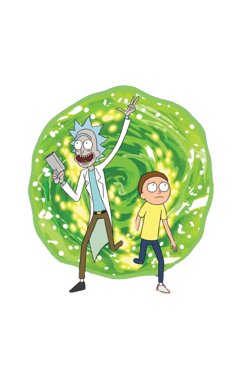

# Rick and Morty

## Objetivos

Tive como objetivo aprimorar minhas habilidades em **ReactJS**, para isso usei **styled components** e a **API do Rick And Morty**.

Para isso criei uma aplicação que lista os personagens que aparecem no seriado.

O aplicação possui paginação.

## Tecnologias utilizadas

- [ReactJs](https://pt-br.reactjs.org/)
- [Styled Components](https://styled-components.com/)
- [Rick And Morty API](https://rickandmortyapi.com/)
